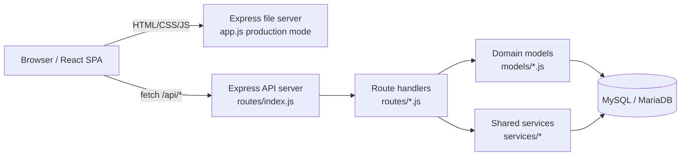

# Project Overview
EEC Walkthrough React is a full-stack wiki and training platform for the Oregon
State University Energy Efficiency Center. The repository combines an Express API,
a React single-page application, MySQL/MariaDB persistence, and Docker-based local
development so contributors can browse, edit, review, publish, and report on
energy-efficiency content from one codebase.

## Repository Structure
- `.github/` - GitHub Actions workflows for container build and publish automation.
- `client/` - React frontend, static assets, Redux state, and browser-side tests.
- `docker/` - Dockerfiles and database container configuration used by local dev and CI.
- `models/` - Database access helpers organized by domain object.
- `routes/` - Express route handlers mounted under `/api/*` plus static middleware.
- `services/` - Authentication, validation, formatting, database bootstrap, and utilities.
- `secrets/` - Local secret files for Docker and development; expected locally and gitignored.
- `app.js` - Backend entrypoint that starts the API server and production file server.
- `docker-compose.yml` - Recommended local development stack for app, database, and phpMyAdmin.
- `README.md` - Primary setup, environment, build, and production deployment guide.
- `DOCKER.md` - Docker-specific setup, access points, and troubleshooting notes.
- `CONTRIBUTING.md` - Branching, review, security, and contribution workflow guidance.
- `.env.example` - Template for required runtime environment variables.
- `.eslintrc.json` - Root ESLint rules shared by the JavaScript codebase.

## Build & Development Commands
Use the repo root unless noted otherwise.

### Install
```bash
npm run installAll
```

### Run Locally
```bash
npm run dev
```

### Run With Debugger
```bash
npm run dev:debug
```

### Run Production Mode
```bash
npm start
```

### Build Frontend For Production
```bash
npm run build
```

### Docker Development
```bash
docker compose up -d
docker compose logs -f app
docker compose down
```

### Tests
```bash
cd client && npm test
```

### Lint
```bash
eslint "." --fix
```

### Type Check
> TODO: No dedicated type-check script exists. This repository is JavaScript-based
> and does not define a TypeScript or Flow type-check step.

### Deploy
```bash
cd client && npm run deploy
```

```bash
cd /webdev/deployment/eec-walkthrough-react
sudo -u walkthrough bash
git pull
npm run build
/data/walkthrough/start-wt.sh
```

## Code Style & Conventions
- Use JavaScript with ES modules in the client and CommonJS on the backend.
- Follow the existing ESLint rules in `.eslintrc.json` and `client/.eslintrc.json`:
  2-space indentation, double quotes, semicolons, `camelCase`, `prefer-const`,
  `curly: all`, `eqeqeq: smart`, Unix line endings, and spaced comments.
- Name React components with `PascalCase`, utilities with `camelCase`, routes with
  `camelCase`, and CSS files to match their component or page.
- Keep components focused; extract reusable logic into utilities or shared components.
- Match existing project patterns before introducing a new structure or library.
- Add comments only for non-obvious logic; prefer readable names over explanatory noise.
- Default branch workflow: branch from `dev` and target pull requests back to `dev`.
- Commit message template:

```text
type: short imperative summary

Why this change was needed and what behavior it improves.
Mention follow-up risks, rollout notes, or migrations if relevant.
```

- Common commit types in this repo: `feat`, `fix`, `chore`, `docs`, `test`.

## Architecture Notes


`app.js` starts two server concerns: the API server on `API_PORT` and, in
production, a separate file server on `FILE_PORT` that serves `client/build` and
uploaded files. `routes/index.js` mounts domain-specific routers under `/api/*`.
Those routers delegate persistence to `models/*.js`, auth and validation to
`services/authentication` and `services/validation`, and shared data shaping to
`services/format` and `services/utils`. On the frontend, `client/src/App.js`
defines the main route tree, Redux store wiring lives in `client/src/redux`, and
feature pages under `client/src/pages` fetch JSON from the API and render
content-management flows for pages, quizzes, contributors, uploads, and reports.

## Testing Strategy
1. Use Docker-first development when possible: `docker compose up -d` gives you the
   app, database, phpMyAdmin, and debugger on production-like services.
2. Run frontend tests with CRA/Jest from `client`: `cd client && npm test`.
3. Treat manual integration testing as required for backend and content workflows:
   login, upload, page editing, publishing, quiz flows, and reporting.
4. Check both browser console output and server logs before opening a PR.
5. In CI, the only configured workflow is `.github/workflows/container.yml`, which
   builds the Docker image on pull requests and builds then publishes to GHCR on
   `dev` pushes and the scheduled job.

> TODO: The repository includes Testing Library dependencies but currently has no
> committed test files under `client/src` and no backend automated test suite.

> TODO: No e2e framework such as Playwright or Cypress is configured.

## Security & Compliance
- Never commit `.env`, `secrets/`, database passwords, JWT secrets, or tokens.
- Use `.env.example` as the template for local environment variables.
- Store sensitive values in `secrets/mysql_password.txt`,
  `secrets/mysql_root_password.txt`, and `secrets/jwt_secret_key.txt`.
- Treat all credentials shown in docs as examples only; generate real local secrets.
- Review `git status` and `git diff` before every commit or PR for accidental secret
  exposure.
- The application handles authentication and authorization in
  `services/authentication/cookieAuth.js`; preserve role checks when modifying routes.
- Uploaded files and rich text are user-controlled inputs; preserve validation and
  sanitization paths in `routes/files.js`, `services/validation`, and the client
  sanitization helpers.
- CI currently builds and publishes a container image, but no dependency scanning or
  secret scanning workflow is defined in this repo.
- License: MIT. Preserve the existing license header and attribution requirements.

## Agent Guardrails
- Never edit or commit `.env`, files inside `secrets/`, generated local uploads, or
  real credentials.
- Do not change production deployment commands or branch targets without explicit
  human approval; this repo deploys from `dev`, not `main`.
- Prefer minimal, targeted changes that match the existing JavaScript style and file
  organization.
- Read nearby route, model, and service code before changing API behavior; many flows
  rely on parallel backend and frontend assumptions.
- Run the most relevant local verification before finishing:
  `npm run dev`, `cd client && npm test`, Docker smoke checks, or targeted manual
  QA depending on the change.
- Escalate for review before touching authentication, authorization, upload handling,
  CSP/security headers, Docker secrets, or database bootstrap SQL.
- Avoid mass formatting or unrelated refactors in feature branches.
- If a task requires new env vars, document them in `.env.example` and the relevant
  docs in the same change.

## Extensibility Hooks
- Environment variables:
  `API_PORT`, `FILE_PORT`, `REACT_APP_API_HOST`, `NODE_ENV`, `MYSQL_DB_NAME`,
  `MYSQL_HOST`, `MYSQL_PORT`, `MYSQL_USER`, `SENTRY_DSN`, `SENTRY_CLIENT_DSN`,
  `SENTRY_ENVIRONMENT`.
- Browser runtime configuration: add a key to `runtimeConfig` in `app.js`, which the
  file server serves at `/runtime-config.js`; read it from `window.__RUNTIME_CONFIG__`.
- Secret file hooks:
  `MYSQL_PASSWORD_FILE`, `MARIADB_PASSWORD_FILE`, `MARIADB_ROOT_PASSWORD_FILE`,
  `JWT_SECRET_KEY_FILE`.
- API expansion point: add a new router in `routes/`, mount it in `routes/index.js`,
  and create matching persistence helpers in `models/` plus validation/services as
  needed.
- Frontend expansion point: add a page under `client/src/pages`, wire it into
  `client/src/App.js`, and add shared UI under `client/src/components`.
- Redux extension point: update `client/src/redux/store`, `actions`, `reducer`, and
  `selectors` when introducing shared client state.
- Docker extension point: update `docker-compose.yml` and `docker/app/Dockerfile.dev`
  for new local services or build arguments.

> TODO: No formal feature-flag system is defined in the current codebase.

## Further Reading
- [README.md](README.md)
- [DOCKER.md](DOCKER.md)
- [CONTRIBUTING.md](CONTRIBUTING.md)
- [.env.example](.env.example)
- [docker-compose.yml](docker-compose.yml)
- [.github/workflows/container.yml](.github/workflows/container.yml)
